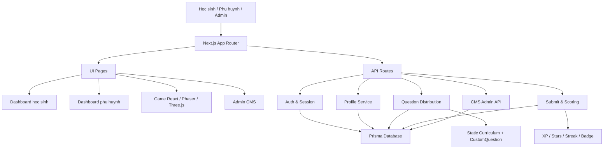

# Học Vui

Học Vui là nền tảng học tập tương tác dành cho học sinh tiểu học lớp 1-5 tại Việt Nam. Sản phẩm kết hợp lộ trình học theo cấp lớp, ngân hàng câu hỏi, game học tập, bảng xếp hạng, dashboard học sinh, dashboard phụ huynh và CMS admin để quản trị nội dung.

Mục tiêu của dự án là giúp trẻ học đều hơn bằng trải nghiệm ngắn, vui, có phản hồi tức thì; đồng thời giúp phụ huynh nhìn rõ con đang học gì, tiến bộ ở đâu và cần ôn phần nào.

## Trạng thái hiện tại

- Frontend: Next.js App Router, React, CSS Modules, Tailwind CSS.
- Backend: Next.js API Routes.
- Database: Prisma ORM, hỗ trợ SQLite local và PostgreSQL/Supabase production.
- Auth: đăng nhập phụ huynh bằng email/mật khẩu hoặc Google OAuth; admin dùng cùng trang đăng nhập với chế độ admin.
- Game: có hệ thống game chuẩn React, Phaser 2D và Three.js/R3F-style 3D runner.
- CMS: có admin dashboard, quản lý câu hỏi, học sinh, phụ huynh, thống kê và module nội dung.
- Deploy: ưu tiên Vercel.

## Tính năng chính

### Học sinh

- Dashboard theo lớp tại `/learning/[gradeSlug]`.
- Bản đồ học tập tại `/learning/[gradeSlug]/map`.
- Kho game tại `/learning/[gradeSlug]/games`.
- Luyện tập, kiểm tra, báo cáo và thành tích theo cấp lớp.
- Tủ đồ và nhân vật đồng hành tại `/kids-closet`.
- XP, sao, streak, huy hiệu và bảng xếp hạng.

### Phụ huynh

- Đăng nhập, đăng ký và quản lý phiên tại `/parent-login`.
- Dashboard phụ huynh tại `/parent-dashboard`.
- Theo dõi hồ sơ con, tiến độ, hoạt động học, kỹ năng yếu và gợi ý ôn tập.
- Quản lý nhiều hồ sơ trẻ trong cùng một tài khoản phụ huynh.

### Admin CMS

- Trang quản trị tại `/admin`.
- Quản lý Question Bank.
- Quản lý học sinh, phụ huynh và thống kê hệ thống.
- Quản lý module CMS: curriculum, games, learning map, reports, media, AI studio và settings.
- API admin được tách riêng trong `/api/admin/*`.

### Game học tập

Hệ thống hiện có nhiều dạng game để phân bổ theo lớp và kỹ năng:

- Chọn đáp án: `/game-choose-1-of-2`
- Nghe và chọn: `/game-listen-and-select`
- Ghép đôi: `/game-simple-matching`, `/game-word-match`
- Memory: `/game-memory-card`, `/game-memory-flip`
- Phaser 2D: bắt vật rơi, kéo thả, speed runner, money shop, code maze, story branch, explore map, fraction builder, virtual lab, code lock, team race.
- 3D runner: `/game-quiz-runner-3d`
- Các màn theo chủ đề: math battle, math treasure, science lab, history map, spelling sprint, English quest, daily mission.

## Kiến trúc tổng quan



## Cấu trúc thư mục quan trọng

```txt
src/
  app/
    page.js                         Trang chủ
    parent-login/                   Đăng nhập phụ huynh/admin
    parent-dashboard/               Dashboard phụ huynh
    admin/                          CMS admin
    learning/[gradeSlug]/           Không gian học sinh theo lớp
      page.js                       Dashboard học sinh
      games/page.js                 Kho game theo lớp
      map/page.js                   Bản đồ học tập
      practice/page.js              Luyện tập
      test/page.js                  Kiểm tra
      report/page.js                Báo cáo
      achievements/page.js          Thành tích
    game-*/                         Các màn game độc lập
    api/                            API routes

  lib/
    auth.js                         JWT/session helper
    db.js                           Prisma client singleton
    progress-summary.js             Tổng hợp tiến độ
    question-bank.js                Chuẩn hóa dữ liệu câu hỏi CMS
    question-distribution.js        Chọn câu hỏi theo lớp/kỹ năng/game
    scoring-service.js              XP, sao, streak, level
    badge-catalog.js                Điều kiện huy hiệu
    games/                          Engine, theme, catalog và UI game
    data/                           Dữ liệu chương trình học fallback

prisma/
  schema.prisma                     Schema database

tests/
  *.test.js                         Test game catalog, scoring, adapter
```

## Database

Các model chính trong Prisma:

- `Parent`: tài khoản phụ huynh.
- `ChildProfile`: hồ sơ trẻ, lớp, avatar, mascot.
- `Progress`: level hiện tại, completed levels, stars, streak.
- `CustomQuestion`: ngân hàng câu hỏi CMS.
- `LearningAttempt`: lịch sử lượt học/game/test.
- `StudentAnswer`: chi tiết đáp án từng câu.
- `StudentBadge`: huy hiệu đã mở khóa.
- `ParentNotification`: thông báo cho phụ huynh.
- `AdminCmsItem`: dữ liệu CMS dạng module.

Local mặc định dùng SQLite để phát triển nhanh. Production nên dùng PostgreSQL/Supabase.

## Luồng học tập

1. Phụ huynh đăng nhập hoặc đăng ký.
2. Phụ huynh tạo hồ sơ trẻ và chọn lớp.
3. Trẻ vào dashboard theo `gradeSlug`, ví dụ `/learning/lop-1`.
4. Trẻ chọn bài học, bản đồ hoặc game.
5. Game gọi `/api/questions` để lấy câu hỏi phù hợp với lớp, world, level, skill và game type.
6. Khi hoàn thành, client gửi kết quả lên `/api/student/submit`.
7. Backend tính điểm, XP, sao, streak, huy hiệu và lưu lịch sử học.
8. Dashboard học sinh/phụ huynh đọc dữ liệu thật từ database để hiển thị tiến độ.

## Cài đặt local

Yêu cầu:

- Node.js 18 trở lên.
- npm 9 trở lên.

```bash
git clone https://github.com/Wendy84205/LearningWebsite.git
cd LearningWebsite
npm install
```

Tạo file `.env`:

```env
DATABASE_URL="file:./dev.db"
JWT_SECRET="thay-bang-secret-manh"
ADMIN_SECRET="thay-bang-secret-manh"
ADMIN_USERNAME="admin"
ADMIN_PASSWORD="doi-mat-khau-admin"
NEXT_PUBLIC_GOOGLE_CLIENT_ID=""
```

Khởi tạo database và chạy dev server:

```bash
npx prisma db push
npm run dev
```

Mở trình duyệt tại `http://localhost:3000`.

## Scripts

```bash
npm run dev          # Chạy development server
npm run build        # Build production
npm run start        # Chạy production server sau build
npm run lint         # ESLint
npm test             # Node test runner cho game/scoring
npm run db:check     # Kiểm tra kết nối database
npm run db:sqlite    # Chuyển Prisma sang SQLite local
npm run db:postgres  # Chuyển Prisma sang PostgreSQL production
npx prisma studio    # Mở giao diện xem database
npx prisma db push   # Đồng bộ schema vào database
```

## Biến môi trường

| Biến | Bắt buộc | Mô tả |
|---|---:|---|
| `DATABASE_URL` | Có | SQLite local hoặc PostgreSQL/Supabase URL |
| `DIRECT_URL` | Tùy môi trường | URL direct khi provider PostgreSQL cần |
| `JWT_SECRET` | Có | Secret ký session phụ huynh |
| `ADMIN_SECRET` | Có | Secret ký session admin |
| `ADMIN_USERNAME` | Tùy chọn | Tên đăng nhập admin, mặc định `admin` |
| `ADMIN_PASSWORD` | Có ở production | Mật khẩu admin, không commit vào Git |
| `NEXT_PUBLIC_GOOGLE_CLIENT_ID` | Tùy chọn | Google OAuth Client ID phía client |

Không commit `.env` hoặc bất kỳ mật khẩu/token thật nào lên Git.

## Auth và bảo mật

- Parent session và admin session dùng cookie HTTP.
- Admin không dùng route login riêng; cùng `/parent-login` nhưng chọn chế độ admin.
- API dashboard không nhận `parentId` từ client mà lấy parent từ session.
- Các API progress/profile cần kiểm tra hồ sơ thuộc parent đang đăng nhập trước khi đọc/ghi.
- Security headers được cấu hình ở proxy/middleware, bao gồm CSP cho Google Sign-In.
- Production cần secret mạnh, database URL đúng, Google OAuth origin đúng domain.

## Question Bank

Question Bank là lõi cho game, learning map, bài tập, kiểm tra, báo cáo và AI generator.

Schema câu hỏi chuẩn hóa quanh các trường:

- `grade`
- `subject`
- `topic`
- `skill`
- `type`
- `difficulty`
- `q` hoặc `question`
- `options`
- `correct`
- `explanation`
- `imageUrl`
- `audioUrl`
- `gameTypes`
- `status`

API chính:

- `GET /api/admin/questions`
- `POST /api/admin/questions`
- `GET /api/admin/questions/[id]`
- `PUT /api/admin/questions/[id]`
- `DELETE /api/admin/questions/[id]`
- `GET /api/questions`

## Quy ước lớp học

Các lớp dùng slug:

- `lop-1`
- `lop-2`
- `lop-3`
- `lop-4`
- `lop-5`

Dữ liệu fallback nằm trong `src/lib/data/`. Game catalog theo lớp nằm trong `src/lib/games/grade-game-catalog.js`.

## Kiểm thử

Chạy kiểm thử nhanh:

```bash
npm test
npm run lint
npm run build
```

Các test hiện tập trung vào:

- Catalog game theo lớp.
- Cơ chế scoring.
- Adapter câu hỏi cho game.
- Mapping Phaser game mechanic vào grade catalog.

## Deploy

Khuyến nghị deploy bằng Vercel.

Checklist production:

1. Cấu hình `DATABASE_URL` PostgreSQL/Supabase.
2. Cấu hình `JWT_SECRET`, `ADMIN_SECRET`, `ADMIN_PASSWORD`.
3. Cấu hình `NEXT_PUBLIC_GOOGLE_CLIENT_ID` nếu dùng Google OAuth.
4. Chạy `npm run db:postgres`.
5. Chạy `npx prisma db push`.
6. Deploy lên Vercel qua GitHub hoặc Vercel CLI.

Chi tiết xem thêm `DEPLOY.md`.

## Nguyên tắc phát triển

- Không hardcode dữ liệu dashboard nếu đã có API/database.
- UI mới nên bám design system hiện có và ưu tiên mobile-first.
- Game mới phải đi qua catalog để phân bổ theo lớp, không tạo route rời rạc mà không có entry.
- API đọc/ghi dữ liệu trẻ phải xác thực session và quyền sở hữu profile.
- Nội dung học nên bám chương trình tiểu học Việt Nam, chia nhỏ theo kỹ năng và độ khó.
- Trước khi kết thúc task nên chạy ít nhất `npm test`, `npm run lint` và `npm run build` nếu có thay đổi code.

## Tài liệu liên quan

- `architecture_map.md`: sơ đồ kiến trúc chi tiết.
- `DESIGN_SYSTEM.md`: quy chuẩn UI/design.
- `QUESTION_BANK_FLOW.md`: luồng Question Bank.
- `GAME_ENGINE_FLOW.md`: luồng game engine.
- `DEPLOY.md`: hướng dẫn triển khai.
- `TESTING_CHECKLIST.md`: checklist kiểm thử.
- `AGENT_TEAM.md` và `AI_RULES.md`: quy tắc vận hành agent/skill khi phát triển dự án.

## License

MIT. Dự án thuộc nhóm phát triển Học Vui.
