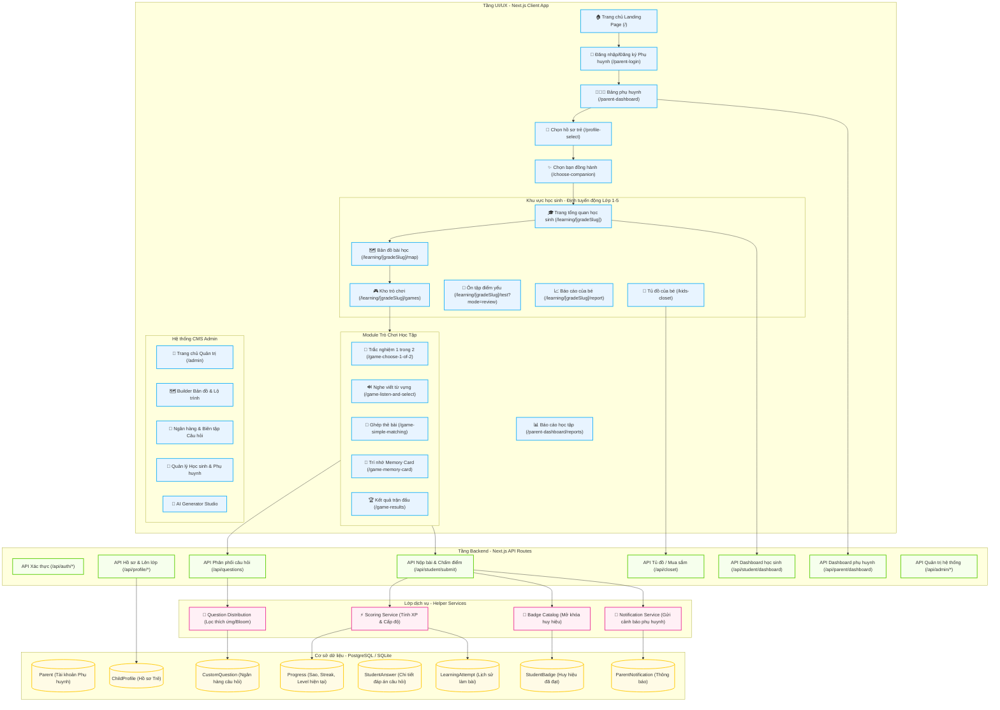

# Sơ đồ Kiến trúc & Cấu trúc Hệ thống Website HocVui

Bản tài liệu này mô tả chi tiết toàn bộ cấu trúc định tuyến (Routing), Kiến trúc dịch vụ (Services), Mô hình dữ liệu (Database Schema), và luồng tương tác cốt lõi của nền tảng EdTech **Học Vui**.

---

## 🗺️ 1. Sơ đồ Kiến trúc Tổng quan (Mermaid Diagram)



---

## 🗂️ 2. Phân rã thư mục & Chức năng chi tiết (File Structure)

### 2.1 Router Frontend (`src/app/`)
* **`/` (Landing Page)**: Giới thiệu ứng dụng học tập, định hướng phương pháp giáo dục Gamification.
* **`/parent-login/`**: Đăng nhập, đăng ký tài khoản cho Phụ huynh.
* **`/parent-dashboard/`**: Bảng điều khiển dành riêng cho Phụ huynh theo dõi sự tiến bộ, thời gian học tập, xem biểu đồ hoạt động 7 ngày và quản lý con cái.
* **`/profile-select/`**: Trang chọn hồ sơ trẻ (bé click chọn tên/avatar của mình để bắt đầu).
* **`/choose-companion/`**: Nơi trẻ chọn bạn đồng hành (Mascot Robot Tin Tin, v.v.).
* **`/learning/[gradeSlug]/`**:
  * **`page.js`**: Dashboard chính của học sinh theo lớp học tương ứng (Lớp 1 - 5).
  * **`/map/`**: Bản đồ lộ trình học tập 3D sinh động, biểu diễn các Thế giới học tập dưới dạng đảo nổi.
  * **`/games/`**: Danh sách game để rèn luyện kỹ năng tự chọn.
  * **`/report/`**: Báo cáo nhanh kết quả học tập cho trẻ thấy số sao và Cup đạt được.
* **`/kids-closet/`**: Tủ đồ của bé - Nơi đổi sao lấy phụ kiện (Mũ, khăn, kính) trang trí cho Mascot.
* **`/game-*`**: Các trang tương tác trò chơi (Trắc nghiệm, nghe viết, ghép nối, lật thẻ).

### 2.2 API Routes (`src/app/api/`)
* **`/api/auth/`**: Xử lý Cookie, JWT Token và phiên đăng nhập.
* **`/api/profile/`**: Quản lý hồ sơ trẻ và API thăng cấp lớp học tự động (`/api/profile/promote`).
* **`/api/student/`**:
  * **`dashboard`**: Phục vụ dữ liệu thời gian thực cho trang chủ học sinh.
  * **`submit`**: Chấm điểm bài làm của trẻ, tính tỷ lệ chính xác, tăng XP và tích sao.
* **`/api/parent/`**:
  * **`dashboard`**: Phân tích số phút học trong ngày, tuần, tạo gợi ý ôn tập thông minh từ điểm yếu của bé.
* **`/api/admin/`**: Các API phục vụ riêng cho CMS quản trị (Học sinh, Câu hỏi, Cấu hình).

### 2.3 Business Logic (`src/lib/`)
* **`scoring-service.js`**: Chứa thuật toán tính toán XP, Streak, Level và cập nhật lại Tiến độ.
* **`badge-catalog.js`**: Định nghĩa điều kiện mở khóa Huy hiệu (Ví dụ: "Dũng sĩ Toán học" khi đúng liên tiếp 10 câu Toán).
* **`question-distribution.js`**: Thuật toán chọn lọc câu hỏi thích ứng dựa trên mức độ hoàn thành bài học và Bloom Taxonomy (Nhận biết → Thông hiểu → Vận dụng).

---

## 💾 3. Thực thể dữ liệu (Database Schema)

```
+--------------------+      1   đối   nhiều      +--------------------+
|       Parent       |-------------------------->|    ChildProfile    |
| (Email, Password)  |                           | (Name, Grade, Ava) |
+--------------------+                           +--------------------+
                                                           | 1 - 1
                                                           v
+--------------------+      1   đối   nhiều      +--------------------+
|  LearningAttempt   |<--------------------------|      Progress      |
| (XP, Stars, Score) |                           | (Stars, Streak, Lvl)|
+--------------------+                           +--------------------+
         | 1
         | đối nhiều
         v
+--------------------+                           +--------------------+
|   StudentAnswer    |                           |   StudentBadge     |
| (QuesId, IsCorrect)|                           |  (Unlocked Badges) |
+--------------------+                           +--------------------+
```

---

## 🔄 4. Luồng học tập thích ứng (Adaptive Learning Flow)

1. **Khởi đầu**: Trẻ truy cập **Bản đồ học tập (World Map)** và chọn một ải (Level).
2. **Nạp dữ liệu**: Trò chơi gửi yêu cầu đến `/api/questions` kèm `gradeSlug`, `worldId`, `levelId`. Lớp nghiệp vụ sẽ tự động ưu tiên câu hỏi từ ngân hàng câu hỏi tùy chỉnh (do Admin soạn) trước, sau đó nạp từ ngân hàng câu hỏi hệ thống.
3. **Thực thi game**: Trẻ thực hiện tương tác kéo thả, trắc nghiệm hoặc nghe viết âm thanh.
4. **Gửi kết quả**: Client POST dữ liệu trả lời lên `/api/student/submit`.
5. **Cập nhật realtime**:
   * API chấm điểm ghi nhận câu trả lời vào bảng `StudentAnswer`.
   * Tính toán XP cộng thêm và cập nhật Streak.
   * Gửi thông báo tự động (Notification) về bảng điều khiển của Phụ huynh nếu trẻ đạt thành tích xuất sắc hoặc có dấu hiệu học yếu.
